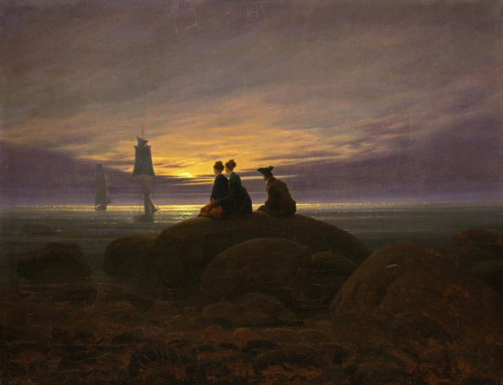
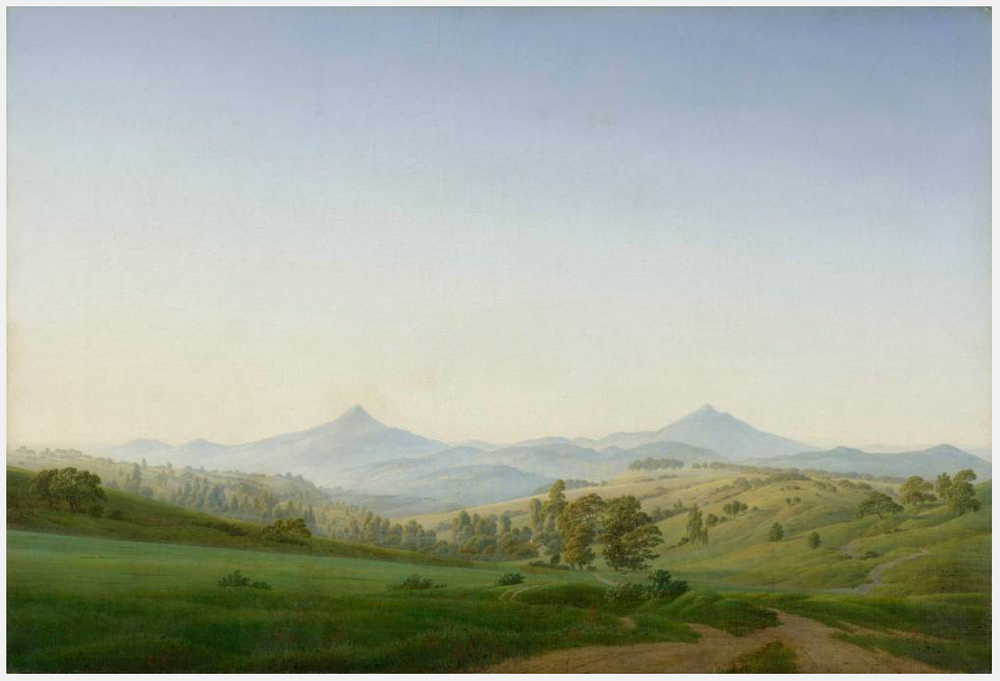
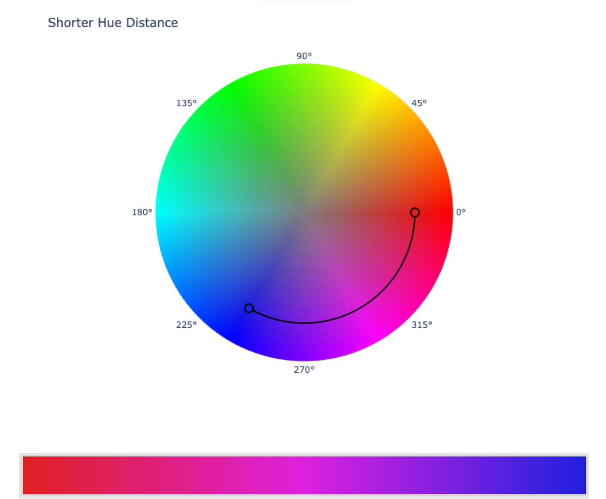
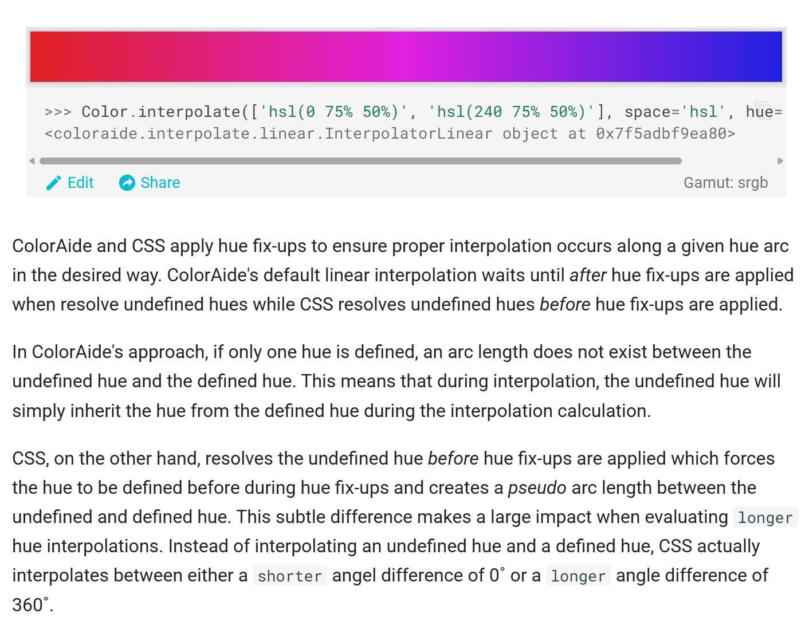

# Quiz 8
## Part 1: Imaging Technique Inspiration

The imaging technique I've chosen is **gradient**, a widespread painting technique that appears in numerous artworks.
I aim to incorporate its colour transition effects into this project, ensuring smooth shifts between hues to showcase the colour variations in the artistic pieces featured in the assignment. This approach will enhance the visual appeal of the final presentation, creating a dreamlike atmosphere and making the visual effects more expressive.

  
 

---

## Part 2: Coding Technique Exploration
Gradient effects can be achieved through **colour interpolation**. This colour interpolation encoding technique generates smoother, more visually harmonious gradients by calculating intermediate values between selected colours across different colour spaces, enabling natural transitions between hues.

Effect Example:

Code Example:

[Code Example](https://facelessuser.github.io/coloraide/interpolation/)

---